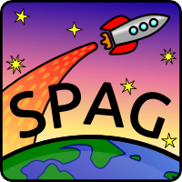

# Super Programme Aérospatial de Grondines

Le *Super Programme Aérospatial de Grondines* (**SPAG**) est un projet de vol
de fusées modèles mené par un oncle et son neveu favori.

## Objectifs

- Activité plaisante et stimulante avec neveu
- Créer des bons souvenirs (album photo...)
- Développer sécurité et responsabiliser
- En apprendre plus sur l'aéronautique
- Camp de fusées durant vacances
- Encourager persévérence

## À faire

- Passer à l'anglais
- Lier sur Rocketry Forum
- Ajouter info nouvelles fusées
  - Novia
  - Astra 1
- Éditer fichiers Open Rocket (versions stock)
  - Novia
  - Astra 1
  - Soumettre [www.thrustcurve.com](www.thrustcurve.com)

## Flotte de fusées

### Actives

- [**Astra 1**](rockets/astra_1/astra_1.md) (Active, 1 vol)
- [**Der Red Max**](rockets/der_red_max/der_red_max.md) (Donnée à Damien, 1 vol)
- [**Novia**](rockets/novia/novia.md) (Donnée à Damien, 3 vols)
- [**Patriot**](rockets/patriot/patriot.md) (Active, 0 vol)
- [**Riptide**](rockets/riptide/riptide.md) (Active, 8 vols)
- [**Viking**](rockets/viking/viking.md) (Active, 1 vol)

### Construction

- [**Grid Bug**](rockets/grid_bug/grid_bug.md) (en construction)
- [**Bull Pup**](rockets/bull_pup/bull_pup.md) (en construction)
- [**V2**](http://www.estesrockets.com/rockets/kits/skill-3/003228-v2-semi-scale-model) en 24 mm couleurs FLR-6 de Tintin (à construire)
- [**Der Red Max**](http://www.estesrockets.com/der-red-maxtm) en 24 mm avec payload (à construire)

### Idées pour futur

- [**AGM-114 Hellfire**](http://www.the-launch-pad.com/#!hellfire/c14ur)
- [**AGM-84 Harpoon**](http://www.allrocketengines.ca/Rockets/Harpoon-AGM)
- [**AIM-54** (from scratch)](http://www.the-launch-pad.com/#!blank/c7bg)
- [**FLAIL**](http://www.the-launch-pad.com/#!blank/c1j13)
- [**Fusée Tintin**](http://en.wikipedia.org/wiki/Explorers_on_the_Moon)
- [**Kerbal Space Program**](https://kerbalspaceprogram.com/)
- [**Photon Probe**](http://www.allrocketengines.ca/Rockets/Photon-Probe)
- [**SA-14 Archer**](http://www.jcrocket.com/sa14archer.shtml)
- AMG-62 Walleye
- AMG=65 Maverick
- AS-37 Martel
- MM-38 Exocet
- Nike Ajax
- Nike Hercules
- Nike Zeus
- RB-83 ???

## Vols

### 2014

#### Stats

- Nombre de vols: 14
- Fusées perdues: 0
- Poussée totale: 61.6 Newtons

#### Moteurs

- A8-3 (18 mm, 2.3N): 4
- B6-4 (18 mm, 4.3N): 6
- C6-3 (18 mm, 8.8N): 4
- C6-5 (18 mm, 8.8N): 0

