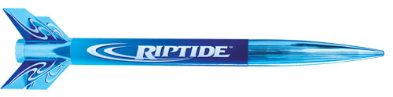

# Riptide

## Images

[Gallerie d'images](http://www.rocketryforum.com/album.php?albumid=594)

## Videos

[Vidéos Youtube](https://www.youtube.com/user/maroonedmorlock/videos)

## Description

- **Name**: Riptide
- **Company**: Estes
- **Skill level**: RTF (ready to fly)
- **Bought on**: 2014-06-12
- **Built on**: 2014-06-28 to 2014-06-28
- **Recommended engines**: B4-4, B6-4, C6-5
- **Projected maximum altitude**: 675 ft. (183 m)

## Characteristics

- **Total length**: 18 in. (46 cm)
- **Nose cone length**: 7.25 in. (18.5 cm)
- **Body tube diameter**: 1.35 in. (35 mm)
- **Weight without motor**: 38 g
- **Fin number**: 4
- **Fin length**: 2 in. (5 cm)
- **Materials**:
  - Nose cone: Plastic
  - Body Tube: Cardboard
  - Fins: Plastic

## Decoration

- **Nose cone color**: Metallic blue
- **Body tube color**: Sky blue
- **Fins color**: Metallic blue
- **Decals**: Printed text (Riptide)

## Reparations

## Notes

- First rocket bought to fly with nephew
- Came with launching pad
- Not sure the chute chord is well fixed

## Flights

- #1, 2014-07-08, east winds 5km, B6-4, **Maiden flight**: perfect takeoff, flight, deployment, and recovery!
- #2, 2014-07-12, west winds 15km, B6-4, perfect takeoff, flight, deployment, and recovery!
- #3, 2014-07-12, west winds 15km, C6-5, perfect takeoff, flight (went high!), deployment, and recovery!

