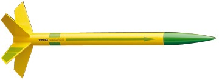

# Viking

## Album

[Construction](http://www.rocketryforum.com/album.php?u=17046)

## Videos

[Vidéos Youtube](https://www.youtube.com/user/maroonedmorlock/videos)

## Description

- **Name**: Viking
- **Company**: Estes
- **Skill level**: 1
- **Bought on**: 2014-06-23
- **Built on**: 2014-06-28 to ...
- **Recommended engines**: 1/2 A6-2 ,A6-4 ,A8-3 ,A8-5 ,B4-4 ,B6-4 ,B6-6 ,C6-5 ,C6-7 
- **Projected maximum altitude**: 

## Characteristics

- **Total length**: 12.1 in. (31 cm)
- **Nose cone length**: 
- **Body tube diameter**: 0.74 in. (19 mm)
- **Weight without motor**: 
- **Fin number**: 3 to 5
- **Fin length**: 
- **Materials**:
  - Nose cone: Plastic
  - Body Tube: Cardboard
  - Fins: White cardboard

## Decoration

- **Nose cone color**: 
- **Body tube color**: 
- **Fins color**: 
- **Decals**: 

# Reparations

## Notes

