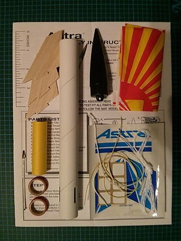

# Quest Astra 1 Gallery

## Flying

Photos to come

## Building

### Opening the kit

This is what the kit looks like :)

### Preparing and building the parts

First, I prepared the motor mount and sanded the fins. I fixed the motor mount
inside the tube and made fillets.

