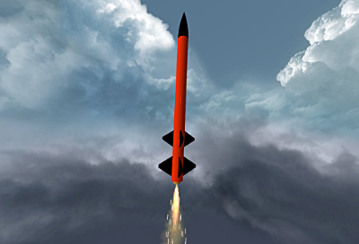

# Critical Mass

Scratch design, payload carrying, two-stage rocket

## Album

[Gallerie d'images](album.md)

## Description

- **Name**: Critical Mass
- **Company**: Scratch build
- **Skill level**: ???
- **Bought on**: NA
- **Built on**: NA
- **Recommended engines**: D and E 24 mm
- **Projected maximum altitude**: 730 m

## Characteristics

- **Total length**: 660 mm
- **Nose cone length**: 148 mm
- **Body tube diameter**: 1.6 in.
- **Weight without motor**: 157 g
- **Fin number**: 4
- **Fin length**: 40 mm (second stage) and 48 mm (booster)
- **Materials**:
  - Nose cone: Plastic
  - Body Tube: Cardboard
  - Fins: Papered balsa

## Decoration

- **Nose cone color**: 
- **Body tube color**: 
- **Fins color**: 
- **Decals**: 

## Reparations

## Notes

## Flights

- #1, yyyy-mm-dd, wind, motor, takeof, flight, deployment, recovery

