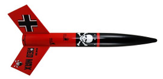

# Der Red Max

## Album

[Gallerie d'images](album.md)

## Videos

[Youtube videos](https://www.youtube.com/user/maroonedmorlock/videos)

## Description

- **Name**: 
- **Company**: 
- **Skill level**: 
- **Bought on**: 
- **Built on**: 
- **Recommended engines**: 
- **Projected maximum altitude**: 

## Characteristics

- **Total length**: 
- **Nose cone length**: 
- **Body tube diameter**: 
- **Weight without motor**: 
- **Fin number**: 
- **Fin length**: 
- **Materials**:
  - Nose cone: 
  - Body Tube: 
  - Fins: 

## Decoration

- **Nose cone color**: 
- **Body tube color**: 
- **Fins color**: 
- **Decals**: 

## Reparations

## Notes

## Flights

- #1, yyyy-mm-dd, wind, motor, takeof, flight, deployment, recovery

