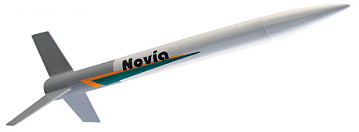

# NAME

## Album

[Gallerie d'images](album.md)

## Description

- **Name**: Novia
- **Company**: Quest
- **Skill level**: 1
- **Bought on**: 2014-06-23
- **Built on**: 2014-07-12 to ...
- **Recommended engines**: A6-4, A8-5, **B6-4, B6-5, C6-5**, C6-7
- **Projected maximum altitude**: 1800 ft. (548 m.)

## Characteristics

- **Total length**: 11.5 in. (29 cm)
- **Nose cone length**: 
- **Body tube diameter**: 0.787 in. (20 mm)
- **Weight without motor**: 0.53 oz. (15 g)
- **Fin number**: 3
- **Fin length**: 
- **Materials**:
  - Nose cone: Plastic
  - Body Tube: Cardboard
  - Fins: Laser-cut balsa

## Decoration

- **Nose cone color**: Deep blue
- **Body tube color**: White
- **Fins color**: Deep Blue
- **Decals**: Maybe Novia from kit or deep blue stripes on body tube

## Reparations

## Notes

- Nice level 1 kit with motor mount.

## Flights

- #1, yyyy-mm-dd, wind, motor, takeof, flight, deployment, recovery

