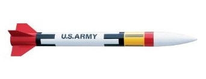

# Patriot

## Album

[Gallerie d'images](album.md)

## Description

- **Name**: Patriot
- **Company**: Estes
- **Skill level**: 1
- **Bought on**: 2014-07-09
- **Built on**: 2014-07-18 to ...
- **Recommended engines**: B4-4, B6-4, C6-5
- **Projected maximum altitude**: 183 m

## Characteristics

- **Total length**: 21.3 in. (54 cm)
- **Nose cone length**: 
- **Body tube diameter**: 1.64 in. (42 mm)
- **Weight without motor**: 57 g
- **Fin number**: 4
- **Fin length**: 35 mm
- **Materials**:
  - Nose cone: Plastic
  - Body Tube: Cardboard
  - Fins: Balsa

## Decoration

- **Nose cone color**: White
- **Body tube color**: White, yellow and red
- **Fins color**: Red
- **Decals**: Kit decals, except 'Patriot' name

## Reparations

## Notes

## Flights

- #1, yyyy-mm-dd, wind, motor, takeof, flight, deployment, recovery

