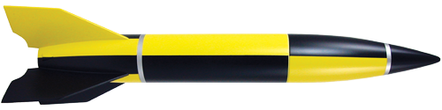

# Estes V2

## Album

[Gallerie d'images](album.md)

## Description

- **Name**: V2
- **Company**: Estes
- **Skill level**: 3
- **Bought on**: 2014-08
- **Built on**: 2014-..
- **Recommended engines**: C11, D12, E motors
- **Projected maximum altitude**: 700 ft.

## Characteristics

- **Total length**: 22.4 in. (57 cm)
- **Nose cone length**: 
- **Body tube diameter**: 2.6 in. (66 mm)
- **Weight without motor**: 179 g
- **Fin number**: 4
- **Fin length**: 
- **Materials**:
  - Nose cone: Plastic
  - Body Tube: Cardboard
  - Fins: Balsa

## Decoration

- **Nose cone color**: 
- **Body tube color**: 
- **Fins color**: 
- **Decals**: 

## Reparations

## Notes

## Flights

- #1, yyyy-mm-dd, wind, motor, takeof, flight, deployment, recovery

